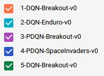

# Deep Reinforcement Learning

This is a project designed to make the development, training and testing of DRL algorithms easy. Any new algorithms can be implemented as an Agent class using tensorflow. Then, they can be compared against each other under the exact same setting.

Agents are derived from the ```BaseAgent``` class, so that a particular algorithms can be implemented in very few lines.

The currently implemented agents are:
* **DQN**
* **PDQN** _Research project. Work in progress_


## Understand the runs


When you are testing many different algorithms in many different settings things can get confusing. DRL tries to organize everything you might need in the simplest manner.

Use ```tensorboard --logdir=log``` to view all the runs. They will be all organized by a number, the name of the agent and the name of the environment.

You can also see the arguments of each run in ```log/[run_name]/config.txt```

## Performance
#### DQN on breakout-v0 (unfinished run)

