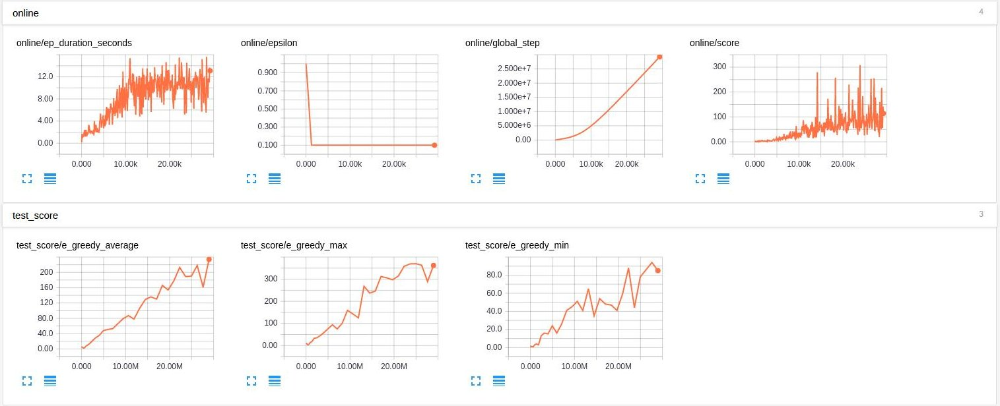

# Deep Reinforcement Learning

This is a project designed to make the development, training and testing of DRL algorithms easy. Any new algorithms can be implemented as an Agent class using tensorflow. Then, they can be compared against other agents under the exact same setting.

The currently implemented agents are:
* **DQN**
* **PDQN** _Research project. Work in progress_

Use ```tensorboard --logdir=log``` to view all the runs.

You can see the arguments of each run in ```log/[run_name]/config.txt```

## DQN on breakout-v0

